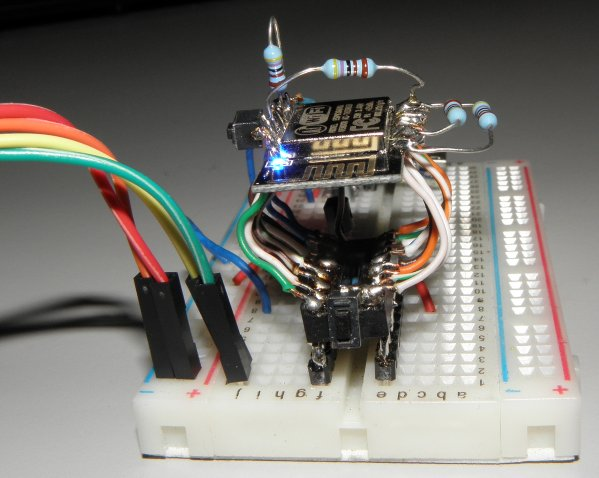

# ChiliLight

This ESP8266 example measures light intesity (LDR via analog input) and temperature (DS18B20 via "one wire") in a room 
and distribute values periodically via MQTT.

Additionally a GPIO output is used to control a relay to switch light on off. This output is controlled via MQTT, too.

The main control is (switching chili light on/off when light intensity drops below some value) is done in another project via Node-Red.

** pins **
<table>

<tr><th>GPIO</th><th>NodeMCU label</th><th>function</th></tr>

<tr> <td>ADC</td> <td>A0</td> <td>LDR meassures light intensity</td> </tr>
<tr> <td>16</td> <td>D0</td> <td>SSR Relay switching the light on/off</td> </tr>
<tr> <td>5</td> <td>D1</td> <td>I2C SCL (bme280)</td> </tr>
<tr> <td>4</td> <td>D2</td> <td>I2C SDA (bme280)</td> </tr>
<tr> <td>14</td> <td>D5</td> <td>one wire DHT11</td> </tr>
<tr> <td>12</td> <td>D6</td> <td>one wire DS18B20 (there are two sesors connected: inside + outside)</td> </tr>
<tr> <td>13</td> <td>D7</td> <td> a single ws2812B LED to show status </tr>

<table>

** Board ** 

